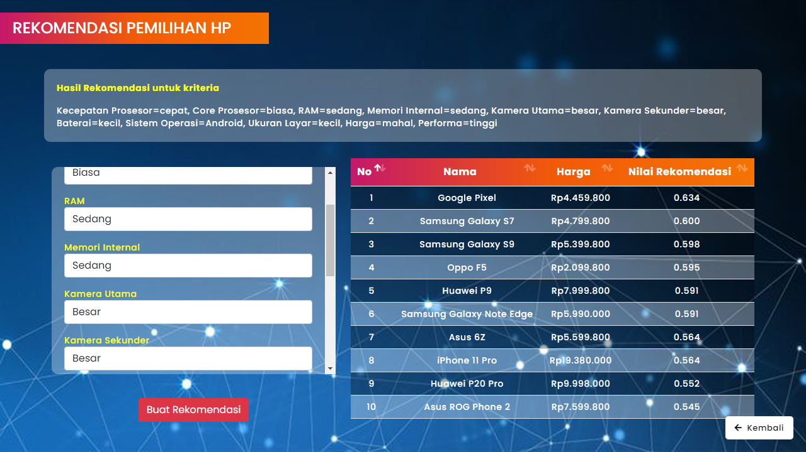

# Fuzzy Tahani Pendukung Pemilihan Smartphone

Sebanyak 65.87% penduduk Indonesia telah memiliki telepon seluler pada tahun 2021. Pasar smartphone di Indonesia diperkirakan meningkat 8% dari tahun sebelumnya menjadi 44 juta unit pada tahun 2022. Pengguna harus mempertimbangkan berbagai faktor seperti harga, spesifikasi, dan lain-lain sebelum memutuskan untuk membeli smartphone. Dalam upaya pengembangan sistem pendukung pemilihan smartphone, penelitian menggunakan metode Fuzzy Tahani. Fuzzy inference system model Tahani akan memproses input yang diberikan oleh user kemudian mengembalikan hasil proses berupa output list rekomendasi smartphone kepada user yang diurut berdasarkan nilai fire strength. Sebagai hasil akhir, model logika fuzzy Tahani dapat digunakan untuk memberikan rekomendasi pemilihan smartphone yang akurat dengan mempertimbangkan berbagai kriteria secara proporsional.

## Metodologi

1. Metode Fuzzy Inference System
   Pada paper ini digunakan Metode Fuzzy model Tahani untuk melakukan inferensi yang akan menghasilkan rekomendasi. Fuzzy inference system akan memproses input yang diberikan oleh user dan kemudian akan mengembalikan hasil proses berupa output list rekomendasi smartphone kepada user yang diurut berdasrakan nilai fire strength. Alur dari sistem pendukung pembelian smartphone digambarkan pada Gambar berikut.
   
   Pertama, pengguna akan memasukkan data input yang mewakili kriteria smartphone. Selanjutnya, data input akan diproses melalui fuzzy query sehingga dihasilkan komponen derajat keanggotaan penentu hasil rekomendasi. Terakhir, dilakukan proses defuzzyfikasi yang akan menghasilkan daftar rekomendasi smartphone kepada pengguna (Prasetyo et al., 2018)

2. Metode Pengumpulan Data
   
   Dalam penelitian ini, data yang digunakan merupakan data smartphone yang diperoleh dari Kaggle (Garai, 2022). Data tersebut kemudian diolah dan disesuaikan kembali sehingga dihasilkan data olahan [(Prasetio et al., 2022)](https://github.com/wdprsto/Fuzzy-Tahani-Pendukung-Pemilihan-Smartphone/blob/main/dataset_28112022.xlsx). Penyesuaian dilakukan terhadap atribut-atribut yang diolah serta merk smartphone yang digunakan. 
   
   
   
   Pemilihan atribut data yang digunakan didasarkan pada (Susanto et al., 2020) yang juga mengembangkan sistem referensi pemilihan smartphone. Atribut yang digunakan dalam penelitian ini meliputi kecepatan prosesor, jumlah core prosesor, besaran ram (dalam MB), memori internal (dalam GB), resolusi kamera utama (dalam piksel), kamera sekunder (dalam piksel), kapasitas baterai (dalam mAh), sistem operasi, ukuran layar (dalam inch), harga (dalam Rp), dan skor performa yang diperoleh dari Antutu Benchmark. Atribut performa ditambahkan sebagai upaya menangani kelemahan penelitian (Susanto et al., 2020) yang tidak membahas mengenai kebutuhan lifestyle dalam memilih smartphone, salah satunya terkait kriteria kemampuan gaming yang bersifat non-teknis. Skor performa Antutu mengukur kinerja CPU, GPU dan RAM yang juga berpengaruh dalam menjalankan aplikasi gim (Prakash et al., 2016). Maka dari itu, atribut ini digunakan sebagai tolok ukur bagi performa gaming. 
   
   
   
   Merk smartphone yang digunakan disesuaikan dengan merk smartphone yang banyak beredar di Indonesia, yang meliputi Apple, Asus, Blackberry, Google, Huawei, Infinix, Lenovo, OnePlus, Oppo, Realme, Samsung, Vivo, dan Xiaomi. Total data hasil olahan yang digunakan dalam penelitian ini ialah 418 data smartphone, lebih banyak dibanding (Susanto et al., 2020) yang hanya menggunakan 49 data smartphone. Data disimpan dalam format csv kemudian diimpor ke dalam basis data MySQL.

## Hasil Implementasi

Fuzzy Tahani diimplementasikan dalam aplikasi berbasis web menggunakan PHP. Ketika pengguna memasukkan input yang mewakili kesebelas kriteria yang ditentukan, maka kriteria yang telah ditetapkan pengguna tersebut akan ditampilkan kembali pada layar, dan diikuti dengan hasil rekomendasi yang telah dikalkulasi oleh Fuzzy Tahani. Hasil rekomendasi ditampilkan dalam bentuk nama smartphone yang diikuti dengan nilai fire strength-nya, seperti yang terlihat pada Gambar.

## Referensi

1. Garai, P. (2022). Mobile Phone Specifications and Prices. Kaggle Datasets. https://www.kaggle.com/datasets/pratikgarai/mobile-phone-specifications-and-prices
2. Prakash, A., Amrouch, H., Shafique, M., Mitra, T., & Henkel, J. (2016). Improving mobile gaming performance through cooperative CPU-GPU thermal management. Proceedings - Design Automation Conference, 05-09-June. https://doi.org/10.1145/2897937.2898031
3. Prasetyo, C. T., Hermawati, F. A., & Ronando, E. (2018). Sistem Rekomendasi Pemilihan Smartphone Berdasarkan Karakteristik Sosio-Demografis Pengguna Menggunakan Metode Fuzzy Tahani. KONVERGENSI, 14(1), 26–36.
4. Susanto, G. M., Kosasi, S., David, D., Gat, G., & Kuway, S. M. (2020). Sistem Referensi Pemilihan Smartphone Android Dengan Metode Fuzzy C-Means dan TOPSIS. Jurnal RESTI (Rekayasa Sistem dan Teknologi Informasi), 4(6). https://doi.org/10.29207/resti.v4i6.2584
